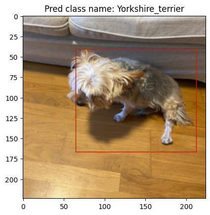

# object_localizer

Object localizer plus multiclass classification project

## Overview
In this project, I developed a system for generating images containing objects embedded in random background images. The project aims to localize these objects within the images and classify them into different categories using a convolutional neural network (CNN) based on the VGG16 model. The system can be used for tasks like object detection and localization in various computer vision applications.

## Features
- **Random Image Generation**: Automatically generate images containing objects placed at random positions on different backgrounds.
- **Object Localization**: Predict the bounding box coordinates of objects within the generated images.
- **Multiclass Classification**: Classify the detected objects into multiple predefined categories.
- **VGG16-based Model**: Utilize a modified VGG16 architecture as the backbone for the object localization and classification tasks.
- **Custom Loss Function**: Implements a custom loss function that averages the contribution of bounding box identification, object presence detection, and object classification. This helps the model learn not only where the object is located but also whether an object is present and which category it belongs to.
- **Data Augmentation**: Apply various augmentation techniques to increase the diversity of training data.
- **Training and Evaluation Pipeline**: Includes scripts for training the model on generated datasets and evaluating its performance on test data.

## Results

- Example predictions with bounding boxes and class labels are visualized at the end of the notebook.

## Model Architecture
- The model is based on the VGG16 architecture, with the following modifications:
  - The fully connected layers are replaced with custom layers to output bounding box coordinates and class probabilities.
  - The network is trained end-to-end using a **custom loss function** that combines three components:
    - **Bounding Box Identification**: Loss related to accurately predicting the bounding box coordinates.
    - **Object Presence Detection**: Loss related to determining whether an object is present in the image.
    - **Object Classification**: Loss related to correctly classifying the detected object into the right category.
  - These components are averaged to ensure the model learns to perform all three tasks effectively.

